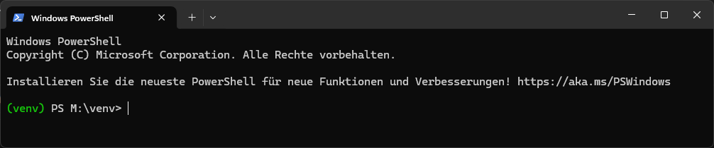

# venv

## Overview
`venv` is an automated virtual environment setup tool designed to streamline development across Windows, Linux, and macOS. It ensures dependencies are managed efficiently and integrates seamlessly with VS Code.

## 🖼 Screenshots


## Features
- **Cross-platform compatibility**: Supports Windows (`.bat`, `.ps1`), Linux (`.sh`), and macOS.
- **Automated environment setup**: Detects Python installation, creates, and activates a virtual environment.
- **Dependency management**: Installs packages from `requirements.txt` and ensures `pip` is up-to-date.
- **VS Code integration**: Includes a `.code-workspace` file for streamlined project management.

## Prerequisites
- **Python 3.6+** installed.
- **VS Code (optional)** for an optimized development experience.

## Installation and Setup
### Windows
#### Using Command Prompt:
```cmd
cd path/to/venv
activate_project.bat
```
#### Using PowerShell:
```powershell
cd path/to/venv
.\activate_project.ps1
```

### Linux/macOS
```bash
cd path/to/venv
chmod +x activate_project.sh
./activate_project.sh
```

## Cloning the Repository
Ensure Git is installed:
```bash
git --version
```
Clone the repository:
```bash
git clone https://github.com/TamerOnLine/venv.git
```
For SSH access:
```bash
git clone git@github.com:TamerOnLine/venv.git
```
Navigate to the project directory:
```bash
cd venv
```

## Setting Up the Virtual Environment
Run the activation script for your OS:
#### Windows (Command Prompt):
```cmd
activate_project.bat
```
#### Windows (PowerShell):
```powershell
.\activate_project.ps1
```
#### Linux/macOS:
```bash
chmod +x activate_project.sh
./activate_project.sh
```

## Installing Dependencies
After activating the virtual environment:
```bash
pip install -r requirements.txt
```

## File Structure
```
venv/
├── .github/                 # GitHub workflows and CI/CD
├── .pytest_cache/           # Pytest cache for test runs
├── img/                     # Image assets (if applicable)
├── src/                     # Source code
├── tests/                   # Test scripts
├── venv/                    # Virtual environment folder
├── .env                     # Environment variables
├── .gitignore               # Git ignore rules
├── activate_project.bat     # Windows CMD script
├── activate_project.ps1     # Windows PowerShell script
├── activate_project.sh      # Linux/macOS Bash script
├── LICENSE                  # License file
├── README.md                # Documentation
├── requirements.txt         # List of dependencies
├── runtime.txt              # Python runtime version
└── workspace.code-workspace # VS Code workspace file
```

## Usage
### Activating the Virtual Environment
Once activated, you should see a modified prompt:
```bash
(venv) user@machine:~/venv$
```

### Installing Dependencies
```bash
pip install -r requirements.txt
```

### Deactivating the Virtual Environment
To exit:
```bash
deactivate
```

## Troubleshooting
- **Python not found**: Ensure Python 3.6+ is installed and added to the system path.
- **Activation failure**: Delete the `venv` folder and rerun the activation script.
- **Permission issues (Linux/macOS)**: Use `chmod +x activate_project.sh` to grant execution permissions.

## Contribution
Submit pull requests or report issues on the [GitHub repository](https://github.com/TamerOnLine/venv).

## License
This project is licensed under the MIT License. See [LICENSE](LICENSE) for details.

